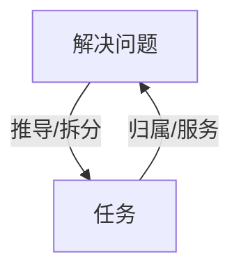
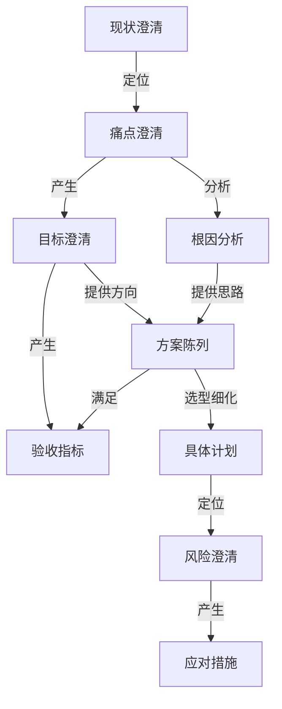
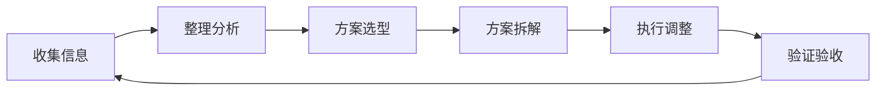
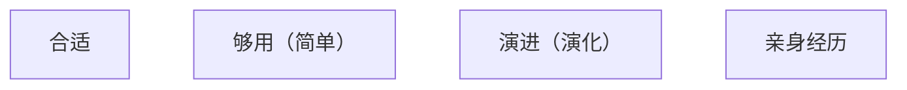

# Begin

上一篇里我讲述了关于“五年”目标的由来、以及我的几个“五年”概述，这篇开始正式分享第二个“五年”我到底总结了什么、我到底在训练自己成为一个怎样的人。

为避免本节太过于理论枯燥，我决定在论述方法论过程中，将一个工作实践案例——《聚合登录优化实践》、及一些小案例贯穿后续多篇理论进行联系说明。

# 工作本质

谈工作方法之前肯定需要先对工作有一个认识。在当下我的眼中，工作的本质用一句话概括就是：

<strong>"解决问题，进而产生价值"</strong>

## 关于解决问题

如果第二个“五年”的开头，你问我什么是工作，那我会毫不犹豫地回答“解决问题”！因为我认同《工作就是解决问题》中所说：跳出任务、事项看，一切工作都是在解决问题。

---

### 需求？

也许我们会觉得：我是在做项目、做需求。

是项目、需求没有错。那么如果思考一下“项目/需求与解决问题之间是什么关系？”我个人的答案是：

<strong>项目/需求的来源是问题，项目/需求的目标是解决问题！</strong>

最近我在培训中看到一个类似但感觉很形象的表达：

​    

- 问题=期待-现状（也就是期待与现状之间的GAP）
- 需求=解决问题（也就是让现状向上靠拢/贴合期待）

### 任务？

也很多时候我们的工作内容看起来只是在完成任务。

同样思考一下“任务是哪里来的？为什么要做这个任务呢？”我个人的答案是：

<strong>解决问题（项目/需求）是一个全局/顶层视角，而任务是是从全局/顶层视角推导/拆分出来的事项！</strong>

## 关于产生价值

到了第二个“五年”的结尾，再问我什么是工作，现在我的回答是“解决问题（现象层面），进而产生价值（目的层面）”。

试想如果存在一个问题，也存在能解决它的方案，但在以下几种情况下，我们会怎么选择：

- 问题本身没有带来损失，或者说解决它不会带来收益
- 问题本身没有阻碍收益，或者说解决它不会提升收益
- 当前可用的最优解决方案成本比解决它后带来的（或者提升的）收益还大
- 还有比当前问题解决带来的收益比更加大、更加重要的其他问题

---

我想这样问的时候大家的答案应该都是确定的——**让这个问题先飞一会儿！**

> [!NOTE]
>
> 然而这样简单的道理，我直到一次在跟人沟通的过程中才反应过来：
>
>  那时候在聊一个业务方案（也就是说我已经定了要做这个，讨论的是怎么做）时，对方问“如果不做会怎么样？”，我突然意识到我从来没有跳出来想过“为什么做”、“要不要做”（也就是有没有）。
>
>  而这恰恰是“怎么做”的前置！

## 案例中心

回想最近这几年我很多自发开展的工作任务都是围绕着“解决问题，进而产生价值”的模式开展的、很多被安排的任务/需求我也都会去搞清楚问题是什么、价值是什么，然后再开始规划，最后才是动手做。而早些年很多我不明白的事，后来也在这种思维模式下有了不一样的想法。这里放一些案例：

> [!NOTE]
>
> 这里的案例不过多展开，有些细节（比如一些资料、步骤、原则）在本系列后面的篇中会提及展开。

### 案例1：引入PSR自动加载&版本理念&Composer版本管理

这个事情是我来到新团队第一个月就在计划、第四个月就推动在兼容原有用法的基础上升级支持的一项工作。但出发点并不是为了搞这个而搞、也不是因为之前我就这么用所以我就一定要把这边也改成这样子，而是因为看到了一些问题现象、以及解决问题之后带来的价值：

- 超大脚本包（500+M）与旧版自动加载机制，加载时需要在超大包中搜索性能差、同时镜像空间、容器空间占用也大；
- 没有版本管理工具，要用成熟三方库包只能通过将三方包手动下载下来加入到超大脚本包中实现，但又脱离了三方包本身的迭代版本；
- All In One模式，导致定制化诉求必须同时引入多个版本后分别命名实现（甚至看到有window版本的库包在其中），维护成本高、容易用错。

### 案例2：发布系统的用量

17年的时候，我被安排跟运维团队一起做一个内部发布系统。我一开始不明白：为什么这样一个内部项目，而且还不是游戏（公司主体业务）要用，而是服务于WEB类业务（只包含WEB前后端，服务器体量也是小头），却被看得很重要？直到几年后一次我看这个系统的用量：

- 34部门、280+用户（前后端开发者）
- 600+台服务器（那时候还没有容器，都是虚拟机、物理机）
- 1000+项目、16W+次部署/回滚、50W+次服务器实例操作

---

看着这些用量数据的时候，我突然想：没有这套系统之前我们用的是人工手动操作发布的模式，这得对应这多少人力成本的节约、多少次误操作的规避、多少权限风险的消除。我突然明白了这才是价值所在！甚至后来公司的部分游戏业务都来使用此系统。

### 案例3：为游戏接口中心增加监控

也是17年，我接手了游戏接口中心服务（当时的游戏接口中心承接了全公司数百款游戏的所有游戏外业务、甚至部分游戏内业务与游戏进行数据通信、读写的作用）。我就一直想着给这个服务做系统、业务层的监控告警，但当时部门负责人并不是很支持我做这个事情，最终我还是向他申请把这个事情做了。而几年后，我突然想明白了他当时为什么并不支持我做这个事情：

<strong>当时的我是没有想清楚的，我是因为学了Go、接触了ES、InfluxDB等系列技术栈，为了用而用的。</strong>

> [!NOTE]
>
> 当然并不是说这个监控没有价值，在后来的五年中，它数十次发挥了重要的预警和问题暴露作用，避免了很多损失。

## 视野扩展

- 当然，不仅仅是技术，也不仅仅是工作，人一切有效的行为活动，本质都是——解决问题，进而产生价值。
- 不同的是“解决什么问题”、“产生怎样的价值”。
- 编写代码、流程制定、团队治理、产品设计、企业经营等等背后都遵循这个本质。

> [!NOTE]
>
> 当然这不是说我意识到了这个，我就什么领域都“无敌”了。相反，我仍旧很认可任何一个领域专家都是在时间、经营中成长的。
>
> 这里只是从通用、本质常理来讲讲我对工作的认识。

## 聚焦问题

基于这样的认知，对我而言工作的关键问题就转换成了：

<strong>如何有效、高效、高ROI地解决问题？（也就是能且尽可能多产生价值）</strong>

---

> [!NOTE]
>
> 还记得上篇中第二个“五年”的目标，定下时跟总结时有一些差异，原因就在这里，是因为我对工作本质的认识发生了一些变化：
>
> - 定下时是独立创造，因为当时我认为工作本质重点是解决问题，我在意的是怎样才能创造/改造东西去解决问题
> - 总结时是有效创造，因为这时我认为工作本质重点在产生价值，我聚焦如何有效、高效创造/改造东西去产生价值

# 方法理论

当提到有效、高效解决问题的方法步骤，很容易想到很粗略简单的步骤：发现问题、分析问题、解决问题。

我也认为从顶层视角讲这是对的，所以我开始尝试用这样的方法处理工作。但立马就发现这过于理论概括了，开展过程中遇到了许多疑惑（这里罗列几个主要的）：

- 发现问题：如何才能发现问题？怎样才能发现正确的问题？哪些才是要关注的问题？
- 分析问题：从哪里开始分析问题？怎样才算分析对、分析到位？
- 解决问题：方案是怎么产生的？多种方案时怎么选？方案怎么拆解？执行会一帆风顺吗？执行完就完事了吗？

---

因此我认为需要一些更加细化能指导这个过程执行的通用流程步骤以及原则才能帮助工作（解决问题）的开展落地。以下是这几年借鉴总结并实践优化的一些总结（当然这是基本框架，并不是生搬硬套，视情况适当缩减调整）：

> [!NOTE]
>
> 本篇仅从概述角度陈述过程资料、流程步骤和开展原则，后续的篇幅将会展开分享具体的细节和案例。

## 过程资料

首先整理的是开展工作（有效、高效解决问题）所需的过程资料及其关系，我认为我需要这些我才能理性认知问题、开展工作：

## 流程步骤

为了满足上述过程资料，就需要开展一些流程步骤：

> [!NOTE]
>
> 当然最终是为了达成解决问题、产出价值的目的，而不只是为了获得资料而已

## 开展原则

在前面所涉及的流程步骤和过程资料在运行时，有一些重点原则是我认为需要注意、也是我们常常忽略而进入误区的：

> [!NOTE]
>
> - 前三个原则技术人员应该很熟悉：架构三大原则！
> - 但追溯这三大原则是计算机出现后才被发明的吗？只适用于硬件软件架构场景吗？
> - 答案是这其实就是生活、工作、学习等等活动的基础原则。

# Next

下一篇，我们将进入部分过程资料的展开分享和案例关联！