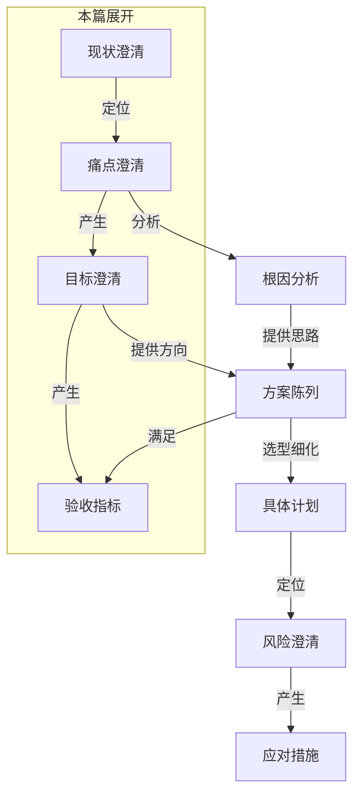
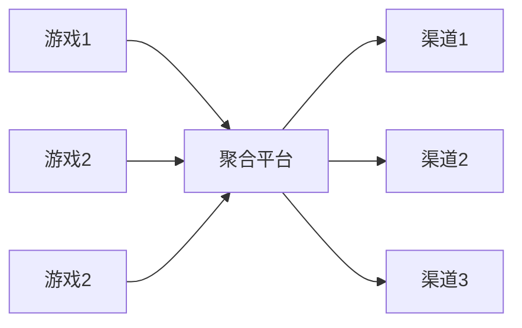
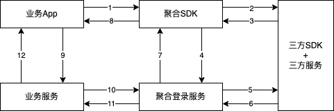

# Begin

​    上一篇中我分享了从这几年对工作本质认知的变化，以及沉淀的方法论概述，这篇分享开始对部分过程资料展开聊一聊（图中被“本篇展开”框框起的部分）：

> [!NOTE]
>
> 这篇开始案例会增加，前面是一些概述和理论，所以案例会少一些。



# 现状澄清

 我们站在太多先辈的肩膀上而非生活在石器时代，因此面对的工作大概率不是从0到1，而是基于大量已存在的工具、流程、方法思想等等（以下简称当前流程）的基础上。

> [!NOTE]
>
> 至少我理了理我的工作框架、所用工具、方式方法等几乎全是如此，几乎没有从自己烧砖造瓦搭建的。

---

 那么，现状澄清就是当前流程的梳理和描述。现状澄清资料应当包括两部分：

## 当前流程的目的

​    **这很重要！！！**

​    **这很重要！！！**

​    **这很重要！！！**

 当前流程既然存在，就有它原本的目的（也就是它本身要解决的问题、它本身能带来的价值）
。如果不知道或者不理会这个，很可能在面对它时不是在解决它在目标场景中存在的问题，而是“解决”了它原本应该发挥的作用！

> [!NOTE]
>
> 当然，并不是说存在就一定完全合理：
>
> - 有可能多年后的问题场景已经不存在了/没关系了，那么这个流程或许到了“功成身退”的时候了。
> - 也可能当年它就并非最优解、又或者是被前人肆意/无意引入的，那么这个流程也确实该被消除。
>
> 只是这些非本系列要讨论的话题。

### 案例1：我看Go一些“不适”设计

 Golang这门语言存在着很多令大家感觉“不适”的、争议的设计，常见的“不适”设计比如：

- 不支持重载，也不支持缺省参数、命名参数；
- 没有exception，而是设计了panic和error；
- 没有基类和继承的概念，却有内嵌、组合和接口实现的概念。

---

 有一天我尝试追溯了解这些“不适”设计的官方初衷：遇到了什么问题、这样设计如何解决问题、解决这些问题的价值是什么？当我尝试站在这样的想法角度去了解的时候，我发现我还挺认可这些设计的目的和价值的。

> [!NOTE]
>
> 关于如何追溯：
>
> - 官方论坛、博客、讨论组等是我们可以获取这些信息的不二选择，我们可以直接从官方获取一手信息；
> - 另外不少书籍/资料（比如[《Go语言设计哲学》](https://golang3.eddycjy.com/posts/started-go/)
    ）中也提及了不少Go的设计理念以及特性缘由（当然前提是有依据的而非臆断）

---

 这时候，我理性认识到当前“不适”是满足原本目的和价值的设计产生的另一些问题，我需要做的是去适应或者解决这些新的问题，而不是一味无脑地埋怨或者敌对。

> [!NOTE]
>
> 当然，我只是在强调既然成为Go的用户就需要理解其设计缘由和目的。
>
> 并不是说这些设计就是最优方案、能满足全部场景，也不是说只能死板按照它的设计理念来处理我们的场景。
>
> > 事实上我在一些场景下也会适度选择反初衷的方案，有一些原则后面会提及。


---

 比如关于错误处理，Go关于错误的设计是显式处理（[关于error的实战，我前段时间有一片专门文章](./)
），原来是官方希望开发者能显式面对错误、合理处理它们。这个初衷我完全认可，因此之后便尝试顺着这个思维去编写程序，后面几年我逐步将“
**会不会出错、哪几种错、我要怎么处理才合适**”的思考习惯融入到了研发过程中。

 所以我怎么来保证我交付的程序质量呢？原因有很多，以后有机会展开分享这个话题，但这里有答案之一——“显式面对和处理错误的思维”！

```go
    tx := conn.GetDB().Table(c.TableName()).Where("code", code).Where("used", CodeUnused).Updates(map[string]any{
"used":  CodeUsed,
"utime": time.Now().UnixMilli(),
})
// 非正常状态，交由调用层处理
if tx.Error != nil {
return tx.Error
}
// 正常拦截状态，独特的错误
if tx.RowsAffected == 0 {
return NoAffectedRows
}
return nil

...

err = model.BindCode(ctx, info.Code)
if err != nil {
if !se.Is(err, model.NoAffectedRows) {
// 非正常状态，需要按照高级别错误处理
} else {
// 算是一种正常拦截状态，可以按照低级别错误处理
}
// 用户都应当收到一些友好提示
return errors.CodeError
}
```

> [!NOTE]
>
>  大家吐槽的无非是遍地if err !=
> nil的美观、代码量问题，但我习惯了显式面对和处理错误的模式（而不是习惯了写法）并且体会到一些好处之后，我完全能接受这样的写法！毕竟我追求的首先是健壮的服务（自洽的逻辑），其次才是写法美观、书写高效等等。
>
>  另外我在刚开始接触Go的前两年也遇到很多不适应之处，但我现在认为之所以这样一个很重要的原因是我习惯了的原有语言模型、范式、思想。
>
> 试想如果我第一次接触软件编程学的就是Go（或者Rust），那么多年后再去面对其他语言的时候，我会怎么是一种什么心态呢？
>
>  关于这个点，Go官方团队很早之前的演讲中有提到过：如果你用“Java”（此处Java是一类语言的代称）的方式来写Go，你会很痛苦；但如果你用“Go”的思想来写Go，你的体验会不一样！（我翻译能力有限，大概这个意思吧～）
>
> ——[《Google I/O 2010 - Go Programming》](https://www.youtube.com/watch?v=jgVhBThJdXc) 大约在开头几分钟提到过。


 而关于面对和处理错误的思考方式，我们不难发现不局限于Go编程，甚至不局限于编程：

```shell
# 调用/执行一个函数/方法、或者我去做件什么事情

# 识别全量可能结果
	# 结果1
		# 做点什么
	# 结果2
		# 做点不一样的
	# 其他
		# 什么都不做
```

### 案例2：《聚合登录优化实践》之现状澄清——目的：

 聚合登录是我在前司时从其他团队合并接手的一个产品。其在内部数百款游戏产品与外部数百个投放渠道之间承担了统一中间者的角色（具体运行流程等下面提及流程步骤时再展开）。



---

 可以想象，在没有这个聚合平台的时候，每款产品都需要按照自己的投放需要，对接外部各种投放渠道（国内外很多投放渠道会要求投放游戏需对接其自身的渠道SDK，其中包括了登录、支付、广告等等，不允许官服包直接投放）。那么出现了以下问题：

- **对接成本高：**成本=游戏产品数*平均对接渠道数，包括人力成本、时间成本（除此类直接成本外有时候市场竞争的是时间，意味着占据市场的落后）；
- **账号管控难：**每个游戏业务要对接任意渠道时，之前都是自行申请渠道账号处理的，账号也是自由管理，基本人员交接一个不小心就没了；
- **功能质量低：**让专注游戏领域的开发者自行对接此类不算游戏领域本身的功能，导致每个游戏业务此类功能质量不一，且整体质量偏低。

---

 所以当时做了聚合平台产品（基本与公司UniSDK、业界QuickSDK/AnySDK等相似），聚合登录就是其中一部分能力。有了聚合平台之后，情况就发生了变化：

- **对接成本低：**单款业务视角成本=对接一次中间聚合平台+配置；全公司业务视角成本=游戏产品数+全部对接渠道数+配置；大大缩减了人力、时间；
- **账号统一管：**该聚合平台成为统一账号管理收口，由办公室进行专项账号管理，同时满足账号管控和使用便捷；
- **功能质量高：**成立专职团队统一设计、对接渠道后再向业务统一提供对接方式，此类功能质量、稳定性更有保障；
- **数据分析齐：**同时还能解决此前此部分数据分散各自为营的痛点，中间层统一沉淀分析数据，为公司视角、业务视角提供横向纵向用户相关行为画像。

---

 可以看到，上面已经清晰说明了聚合平台产品（包括聚合登录）之所以存在的目的（也是背景原因）。

 这个目的有什么用呢？稍等一会，《聚合登录优化实践》这个案例将会完整贯穿后面大部分的理论知识，在下面开展目标澄清时我们再回来关联此处看看“澄清当前流程的目的”的作用。

## 当前流程的步骤

​    **这也很重要！**

​    **这也很重要！**

​    **这也很重要！**

 因为当前流程的步骤恰恰是问题的产生之地，如果想要解决当前流程的问题，却连当前流程的步骤都不清楚的话，至少我觉得自己肯定不能找到对的问题。

> [!NOTE]
>
> 当然也不排除瞎猫碰到死耗子或者是一些彻底颠覆流程结果却创造性解决了问题和产生价值的情况，但这同样不是本系列的重点。

### 案例3：PHP框架性能优化

 来到新团队后，我着手给团队PHP搭建了新的开发框架，虽然比老框架性能已经提升了将近1倍，但后来随着小游戏业务的成功，性能压力问题还是越发明显了。一开始我们肯定是希望基于现有语言框架进行性能优化。所以我便开始了性能优化之旅～

​    [部分过程我之前记录在这篇分享中](./)，但那篇分享中没有记载我怀疑、验证、解决的底层支撑和逻辑是什么：

 要优化性能（解决性能问题），首先得知道问题出在哪个/哪些环节。而要知道问题出在哪个/哪些环节，首先得知道一共有哪些环节。一共有哪些环节——也就是对当前流程步骤的梳理。

 所以PHP-FPM在执行请求的过程中有哪些环节呢？


---

 （还是采用PHP-FPM的语言和 运行模型前提下）需要关注环节以及测试结果发现：

- **转FPM Worker：**可以通过控制FPM Worker数量以及模式测试性能对比；正式环境对应并发场景已经调优过，所以与本次性能优化无关；
- **转OpCode：**可以通过控制OpCache开关变量测试性能对比；正式环境本来就开着OpCache，所以与本次性能优化无关；
- **转机器码：**可以通过控制JIT开关变量测试性能对比；对于我们团队IO密集型的业务场景而言，性能表现几乎无提升；
- **加载框架：**框架内存在很多步骤，可以通过控制执行至不同步骤作为变量测试性能对比；
    - 框架中存在一个兼容旧版本的Session Redis操作，对性能表现影响大；
    - 框架底层加载业务ini配置步骤耗时大、CPU占用高，对性能表现影响大。
- **业务逻辑：**根据业务逻辑有无南桥IO、IO次数等变量测试性能对比；FPM短连模型影响也很大，改成长连后性能表现好很多。

---

 原因及解决方案如下：

- 针对Session Redis操作，相当于所有请求都需要多一次Redis连接并且操作自然是拖后腿的；方案是鉴于现在的业务场景几乎用不到Session，将之移除转为业务需要时手动开启使用；
- 针对加载业务ini配置，相当于所有请求都需要走一遍文件（也是南桥）IO；方案是由于配置不变性，没有必要每次请求都需要从ini文件读取，将ini加载转移至健康检查时加载一次后回写至php文件，（由于FPM下本地缓存比较难搞）借助php
  OpCode作内存级缓存避免此环节消耗；
- DB/Redis/Http
  Client短连模型问题，原因很明显——连接的频繁建立与销毁、socket/tcp四元组的本地端口占用与分配等；但考虑到多业务共享存储资源，长连（FPM的长连是FPM进程级别的，一个业务需要数百个连接）导致连接资源不足、互相影响风险升高，所以暂时不做优化。

---

 按照上述方案处理后的效果：

- 基准压测结果（不带南桥IO）：
    - QPS**提升46～121%**；
    - 响应耗时**降低34～54%**。
- 业务压测结果（带南桥IO）：
    - QPS**提升9～14%**；
    - 响应耗时**降低9～12%**。

---

 而纵观从怀疑目标、验证怀疑、出方案、验证结果等一系列有效行动的背后，有一个有效大前提（否则我很容易无头苍蝇乱撞）：

<center><strong>对当前流程步骤的梳理</strong></center>

### 案例4：《聚合登录优化实践》之现状澄清——步骤

 我接手聚合登录（其实还包括聚合支付等）时，相关资料几乎为零，因此我从头整理了产品全局视角运行/使用流程图：



 基本运行流程是中间的聚合层面向三方时的角色是一个业务应用的角色，完成三方登录后（4->5->
6步骤回来）自己存储了用户信息并将自己作为一个三方渠道开始向真实的业务方进行另一套授权。

---

 那在现状澄清资料中，“当前流程的步骤”为什么重要呢？我先卖个关子，等到下一篇中展开讲根因分析时再来回答。

### 案例5：逆向构建的习惯


在接手其他人的项目（特别是交接离职同学项目）时，我有一个小习惯：从现有资料（比如代码、文档）逆向梳理，构建整个项目全局流程，不单单是服务内部流程逻辑，还会辐射到服务的上下游与服务间的关系。最后一般会形成时序图、泳道图、拓扑图等类文档留存。

 因为这样不仅能快速了解真实的项目流程和状况，还能快速判断变动/修改的可行性，甚至能从中主动发现问题、分析原因（也就是后续的痛点澄清、根因分析等）。比如：

- 上面案例4就是一个很好的例子，后面会继续分享其发挥的作用；
- 23年我接手NGP Go服务，同样也是逆向构建梳理了全局流程，才发现并反馈存在的问题、后续迁移安排等（否则我可能只是将服务接过来而已）。

# 痛点澄清

 既然要解决问题，就需要从头到脚先认识问题——将问题痛点理清楚并说清楚。

> [!IMPORTANT]
>
> 问题痛点应当是从现状澄清中定位到的，如果不是的话，说明现状澄清资料**针对该问题而言**并不全备。

---

 全面的痛点澄清应该由以下部分组成：

- **问题现象：**应当包含问题的客观现象（而非情绪感受）；
- **影响范围与程度：**应当包含问题影响到哪些方面、对象，以及对这些方面、对象具体的影响内容和程度；
- **损失估算：**陈述痛点（问题）带来的损失。除直接经济损失，耗费的人力、资源、时间、口碑等都是损失（如果没有这个问题原本是不需要付出的）。

### 案例6：从VP处为团队拿到QA HC

 在前司的时候，WEB团队长期处于不配QA岗的环境中，所有项目都由开发者开发后自测上线跟进。QA岗的长期缺失对于当时20+人的WEB团队而言实在是弊大于利。于是笔者就同部门经理一起整理提交期望搭建QA团队的说明。

---

 后笔者反思认为VP认可“我们确实需要专职QA岗”很重要的原因点就在于痛点澄清，因为并不是笼统感受一句“弊大于利”，当时我们进行了现状梳理、信息收集与分析，并且论述了一些数据、逻辑：

- 开发人员测试成本量：陈列开发人员测试工作量数据、业界对等开发和QA的薪酬数据，说明这部分成本没有消失只是转移被更高薪酬的开发承担了，这部分成本自然清晰了（具体数据不罗列）。
- 开发人员测试专业度：这个没有办法用量化数据来呈现，但通过”术业有专攻“、”自我检查受思维惯性限制“等通用逻辑与大家都认可的常理，陈述完全依赖开发人员自测效率更低、质量不足等观点。
- 往期事故率及影响面：陈列往期事故可通过QA测试覆盖解决的比例以及影响和损失，涉及支付等类直接陈列影响金额、统计处理事故耗费的人力时间、注明用户流失/口碑影响等隐性损失（具体数据不罗列）。

---

 其实这些背后指向的便是痛点澄清的主要内容：

- 问题现象：（前面1、2两个点）相对于有专职QA的情况，当前没有专职QA的模式没有带来人力成本、时间成本降低（甚至会更高），且质量更差；
- 影响范围与程度：（前面第3点）影响范围是全量项目（其中包括公司级登录/支付/更新等核心能力），影响程度是无法登录/支付/更新、错付/被刷等严重影响；
- 损失估算：包括开发自测的人力成本、发生事故的直接/间接损失、处理事故的排查/善后成本等。

> [!NOTE]
>
> 当然我认为产研流程需要专职QA，但不认为质量必须依赖QA，我更认可“谁开发谁负责”、“问题在流程进程中越早暴露越有利（也就是真正合理的质量左移）”等理念。

### 案例7：《聚合登录优化实践》之痛点澄清

 我接手聚合登录后不久，多个业务团队向VP反馈自己团队的游戏一直以来存在部分登录慢的情况（游戏业务内自行埋了从用户点登录开始到完成登录的数据分析结果），认为非常影响产品扩张和用户留存体验（漏斗），希望可以优化。

 所以在这时候，基于这套聚合平台（含聚合登录服务）出现了痛点：

- 问题现象：登录整体存在慢（耗时长）的现象；
- 影响范围与程度：多个业务产品、影响用户登录体验，进而影响产品扩张、用户留存（具体数据不罗列）；
- 损失估算：由于还未解决缺少缓解后的数据支持，但业务团队反馈数量多、感知严重，VP评估认为间接损失大（这个确实相对主观，不过事后数据证明确实缓解后带来用户数据增长）。

# 目标澄清

 如果现状、痛点是基础，代表对当下状况的的认识。那么另一个不可少的便是目标，代表对未来理想的期望。

> [!IMPORTANT]
>
> - 目标必然是基于痛点澄清产生的，同时也意味着目标是具体、有辐射范围的，而非抽象、泛泛而谈的。
> - 目标一般情况下均应当是有助于、不影响现状澄清中梳理的当前流程目的的（也有少数情况下会选择牺牲部分原目的）。

---

 合适的目标澄清内容如下：

- **目标定义：**清晰描述一个具体、有辐射范围、可理解、可执行的目标（参考OKR smart原则）；
- **程度描述：**有时候目标是彻底解决痛点澄清中的痛点问题，也有的时候我们只希望一定程度上缓解痛点澄清中的痛点问题，所以需要讲清楚目标希望达到的问题解决程度。
- **收益描述：**同理，按照对应目标达到的问题解决程度，需要讲清楚目标达成后的收益程度。

### 案例8：支付风控服务重构

 16年我在做聚合支付的时候，遇到了“支付风控要求高性能、但PHP性能不佳”的**痛点**，那么针对这个痛点的**目标**就是：

<center><strong>使风控服务性能满足要求（收益不用讲——不然支付出问题）</strong></center>

 最终我们决定用Go重构了风控服务。

​    **但**
当时暂时仅限于支付风控服务，并没有将整个支付用Go重构，更没有决定整个团队开始转型Go。因为当下的痛点、目标范围都很明确，其他的服务暂时不存在这样的痛点，相反在当时（16年）Go的生态在国内不够成熟，切换成本和风险非常高。

> [!NOTE]
>
> 事实上直到18年前司团队才开始转型，且是长期PHP+Go并行模式。

### 案例9：《聚合登录优化实践》之目标澄清：

 基于案例7的痛点澄清、以及案例2的原本目的，很显然在当下主要目标是：

<center><strong>在不拿掉聚合登录的前提下，降低登录流程耗时至用户无感知的程度，进而支撑业务用户数据增长。</strong></center>

---

> [!NOTE]
>
>  注意了！这时候的目标有一个前提——**在不拿掉聚合登录的前提下**！
>
> 
>
在前面案例2中我们澄清了聚合登录（聚合平台）本身有一个目的，也就是说其本身是有价值的，如果忽视这个目的，直接废除聚合登录服务就是耗时问题最优解！但这样是不是就是我在理论里提及的“解决”了它原本应该发挥的作用呢？所以“当前流程的目的”很重要的～

# 验收指标

 如何衡量目标达成情况（也就是问题解决情况、产生价值情况）？那就需要验收指标登场了。

> [!IMPORTANT]
>
> - 显然，验收指标应该是基于痛点澄清、目标澄清制定，而非天马行空的。
> - 验收指标同样应该是具体、可量化/讲述的，而非模糊、似是而非的。

---

 合理的验收指标一般以按照**维度/层面划分**，以**分条**的格式出现。且具有**量化数据指标**、或者**逻辑价值证明**的内容。

### 案例10：《聚合登录优化实践》之验收指标：

 这时候很容易找到验收指标：

- 登录耗时的平均（50线）线、90线、95线、99线数据（以及对比提升率）；
- 业务侧用户数据增长数据（具体期望数据不罗列）；

---

 验收指标最后的验收情况，在下下篇中的流程步骤部分会提及。

# Next

 下一篇将展开剩余部分的过程资料。
