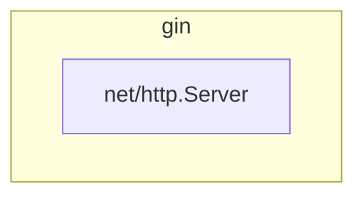
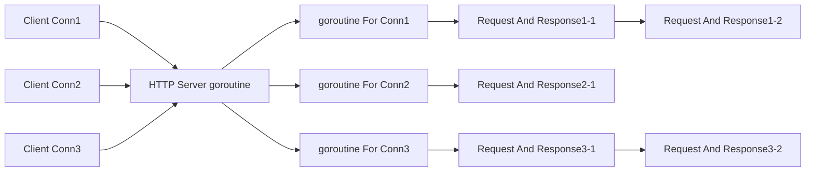

# 背景

	- 初衷：团队转型go时，选型上敲定gin作为http server框架。当时我对gin源码进行了阅读和梳理，以便我可以正确、合适地结合团队业务场景进行二次封装。
	- 附加：在团队开始正式转型时，我意识到http server是团队当下最常见也最基本的场景之一，了解gin以及go标准库中net/http包的基本流程结构对于大家的开发工作和交付质量都有很多的好处。

---

于是当时我整理并在团队中分享了这篇。刚刚正好整理出来了，就炒个回锅肉修饰发布一下此分享。

# 两者关系

- net/http包：go标准库中的HTTP协议的实现（包含Server与Client）
- gin包：当前非常流行的go开发框架，基于net/http包的Server，是对net/http包的Server通用场景的扩充



# net/http包

基于两者的关系，所以我们先来了解一下net/http包中的Server。

> [!NOTE]
>
> 由于我们的目的是理解其逻辑框架便于我们更好的使用它，因此建议自行阅读net/http包中Server时关注整体逻辑框架，而不要过扣细节。
>
>
>
> 随着go版本变化逻辑框架几乎没有大的变动，而细节会有很多变化。
>
> 比如在17年的go1.9版本、21年的1.16版本、最近阅读的1.21版本中，HTTP/1.x逻辑框架（也就是下面提到的运行模型）基本没变，但细枝末节确实改动挺多（源码注释中能看到挺多后来加的bug
> fix、feature等）

### HTTP/1.x运行模型

```go
package http
func (srv *Server) Serve(l net.Listener) error {
	// xxx
	
	for {
    // 对net.Listener（一般目前是tcp socket的抽象）进行accept
		rw, err := l.Accept()
		
		// xxx
		
    // 每accept一个连接，则开一个goroutine进行连接处理
		go c.serve(connCtx)
	}
}
```

```go
package http
// Serve a new connection.
func (c *conn) serve(ctx context.Context) {
	// xxx

	// HTTP/1.x from here on.

	// xxx

	for {
    // 连接读取请求
		w, err := c.readRequest(ctx)

		// xxx

		// HTTP cannot have multiple simultaneous active requests.[*]
		// Until the server replies to this request, it can't read another,
		// so we might as well run the handler in this goroutine.
		// [*] Not strictly true: HTTP pipelining. We could let them all process
		// in parallel even if their responses need to be serialized.
		// But we're not going to implement HTTP pipelining because it
		// was never deployed in the wild and the answer is HTTP/2.
		inFlightResponse = w
    // 执行外部挂的handler业务逻辑
		serverHandler{c.server}.ServeHTTP(w, w.req)
		inFlightResponse = nil
		w.cancelCtx()
		if c.hijacked() {
			return
		}
		w.finishRequest()
		c.rwc.SetWriteDeadline(time.Time{})
		if !w.shouldReuseConnection() {
			if w.requestBodyLimitHit || w.closedRequestBodyEarly() {
				c.closeWriteAndWait()
			}
			return
		}
		c.setState(c.rwc, StateIdle, runHooks)
		c.curReq.Store(nil)

    // 如果不支持/不需要HTTP KeepAlive，则直接结束（该goroutine处理完这个请求就退出）
		if !w.conn.server.doKeepAlives() {
			// We're in shutdown mode. We might've replied
			// to the user without "Connection: close" and
			// they might think they can send another
			// request, but such is life with HTTP/1.1.
			return
		}

    // HTTP KeepAlive系列处理（该goroutine将继续等待并处理连接后续的复用请求）
		if d := c.server.idleTimeout(); d != 0 {
			c.rwc.SetReadDeadline(time.Now().Add(d))
		} else {
			c.rwc.SetReadDeadline(time.Time{})
		}

		// Wait for the connection to become readable again before trying to
		// read the next request. This prevents a ReadHeaderTimeout or
		// ReadTimeout from starting until the first bytes of the next request
		// have been received.
		if _, err := c.bufr.Peek(4); err != nil {
			return
		}

		c.rwc.SetReadDeadline(time.Time{})
	}
}
```

---

不难看出来，其为多协程（goroutine）的模型：

- 一条连接一个goroutine

- KeepAlive复用连接时，goroutine也复用



---

当然，与其他语言在处理HTTP Server时的运行模型相比，我们也会发现很多相似、不同的地方，甚至会有一些疑问：

-
跟多进程模型（比如CGI/FastCGI）、多线程模型（比如Java多线程）很像：[FPM模型](../../php/20230314-PHP-FPM模式下，我为框架增加了伪异步（defer）功能)
- 为什么Go不用异步模型呢？为什么连池都不配呢（比如FPM进程池、Java线程池）？
- Go的思想：少量性能换开发者低心智负担和低维护性（goroutine怎么做到少量性能以后有机会分享）

> [!NOTE]
>
> 不过这些不是本篇内容的重点。

# gin

## 使用示例

gin的使用本身比较简单：

```go
package main

import (
	"fmt"
	"github.com/gin-gonic/gin"
	"net/http"
)

func run() {
	// 初始化gin引擎
	r := gin.Default()

	// 注册接口路由（包括中间件handler和接口handler）
	r.GET("/hello/:name", func(context *gin.Context) {
		fmt.Println("before1")
		context.Next()
		fmt.Println("after1")
	}, func(context *gin.Context) {
		fmt.Println("before2")
		context.Next()
		fmt.Println("after2")
	}, func(context *gin.Context) {
		name := context.Param("name")
		context.String(http.StatusOK, "Hello %s", name)
	})

	// 运行
	err := r.Run(":8080")
	if nil != err {
		fmt.Println(err)
	}
}
```

## 请求链路

```go
package http

func (sh serverHandler) ServeHTTP(rw ResponseWriter, req *Request) {
	handler := sh.srv.Handler
	if handler == nil {
		handler = DefaultServeMux
	}
	if !sh.srv.DisableGeneralOptionsHandler && req.RequestURI == "*" && req.Method == "OPTIONS" {
		handler = globalOptionsHandler{}
	}

  // gin.Engine实现了ServeHTTP(w http.ResponseWriter, req *http.Request)
  // 因此当gin start或者将gin.Engine注册给net/http Server的handler时，后续就是执行gin.Engine.ServeHTTP()
	handler.ServeHTTP(rw, req)
}
```

```go
package gin

// ServeHTTP conforms to the http.Handler interface.
func (engine *Engine) ServeHTTP(w http.ResponseWriter, req *http.Request) {
  // 这段等后面sync.Pool时再讲
  c := engine.pool.Get().(*Context)
	c.writermem.reset(w)
	c.Request = req
	c.reset()
	
  // 请求链路聚焦此处
	engine.handleHTTPRequest(c)

	// 这段等后面sync.Pool时再讲
	engine.pool.Put(c)
}

func (engine *Engine) handleHTTPRequest(c *Context) {
	// xxx

	// 前缀树匹配，前缀树注册流程从接口注册处入手
	// Find root of the tree for the given HTTP method
	t := engine.trees
	for i, tl := 0, len(t); i < tl; i++ {
		if t[i].method != httpMethod {
			continue
		}
		root := t[i].root
		// Find route in tree
		value := root.getValue(rPath, c.params, c.skippedNodes, unescape)
		if value.params != nil {
			c.Params = *value.params
		}
		if value.handlers != nil {
			c.handlers = value.handlers
			c.fullPath = value.fullPath
			
			// 找到路由node后，执行
			c.Next()
			c.writermem.WriteHeaderNow()
			return
		}
		
		// xxx
	}

	// xxx
}

type node struct {
	path      string
	indices   string
	wildChild bool
	nType     nodeType
	priority  uint32
	children  []*node // child nodes, at most 1 :param style node at the end of the array
	// []HandlerFunc，挂着全部的中间件和最后的接口Handler
	handlers  HandlersChain
	fullPath  string
}

// 非并发安全！！！
// addRoute adds a node with the given handle to the path.
// Not concurrency-safe!
func (n *node) addRoute(path string, handlers HandlersChain) {
	// xxx
}

func (c *Context) Next() {
	c.index++
  // 注意这里的int8(len(c.handlers))，c.Abort()其实是将c.index设置为一个最大值，这样就拦截了Next继续执行链路
	for c.index < int8(len(c.handlers)) {
		c.handlers[c.index](c)
		c.index++
	}
}
```

---

顺着逻辑框架整理下来，不难认识到gin的整体流程框架：

- 基于net/http Server
- 通过前缀树维护所有注册的接口路由
- 接口的全部中间件与接口本身逻辑都以HandlerFunc作为interface，并被维护在前缀树的具体node上，形成handler链
- 运行时，通过net/http Server进入到gin.Engine.ServeHTTP逻辑，进而通过前缀树匹配到对应的接口路由node，再依次node的handler链来执行中间件与接口逻辑。

---

通过整体流程框架，我们可以知道在使用时需要注意的事项：

- 路由注册非并发安全，不要同时启多个goroutine进行路由注册（这在源码注释中也有说明）
- 中间件中Next、Abort的使用需要根据自己的需要进行处理，处理不当就会出现比如中间件渲染了错误但没有执行Abort，逻辑会沿着handler链继续执行，最后请求响应了多份body的情况。

> [!NOTE]
>
> 至于为什么没有将路由注册设计成并发安全、为什么没有像其他语言/框架一样将中间件模型设计成弹栈式的洋葱模型，同样不是这篇文章的重点。

## pool优化

```go
package gin
// ServeHTTP conforms to the http.Handler interface.
func (engine *Engine) ServeHTTP(w http.ResponseWriter, req *http.Request) {
  // 现在我们来关注这段
  c := engine.pool.Get().(*Context)
	c.writermem.reset(w)
	c.Request = req
	c.reset()
	
	engine.handleHTTPRequest(c)

	// 还有这段
	engine.pool.Put(c)
}

type Engine struct {
	//  xxx
	pool             sync.Pool
    // xxx
}

func New() *Engine {
	// xxx
	engine.pool.New = func() any {
		return engine.allocateContext(engine.maxParams)
	}
    // xxx
}
```

---

很显然，gin利用了sync.Pool来做性能优化：

- 目标：gin.Context
-
原因：gin.Context中封装了http.Request、http.Response，以及允许开发者挂载各类自定义上下文变量，需要空间大且在goroutine中传播，频繁创建对系统资源压力大；同时已结束的请求gin.Context需要被回收，对GC压力（包括heap回收和协程私有栈收缩）也增大。
- 原理：复用旧的（已结束的）请求gin.Context给后续新的请求，降低空间分配压力，也减少GC量。

---

我们会发现这种优化方法在标准库、三方包中都有大量运用，所以我们高并发业务、基础类库中也可以用，不过却需要小心分配和回收的正确性。

- 性能收益可参考：[为何Gin使用Sync.Pool呢？到底解决框架本身什么性能瓶颈呢？](https://www.modb.pro/db/189609)
-
注意问题可参考：[Security: Don't put the same bytes.Buffer into sync.Pool twice #745](https://github.com/go-resty/resty/pull/745)
    - 此包在使用sync.Pool时，由于忘记资源会在HTTP Client
      Request中被自动Close，在使用后又手动Close一次，执行了两次sync.Pool.Put，导致将同一个资源放入pool两次，并发时可能获取到多个相同地址指向的Request资源，导致并发写入问题。